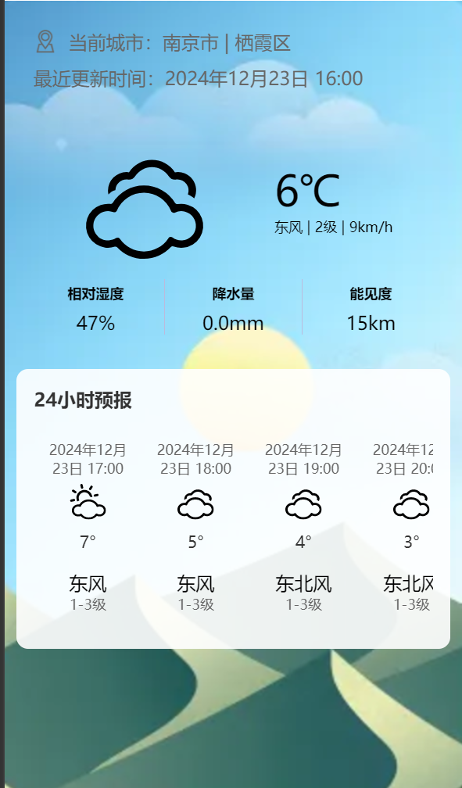
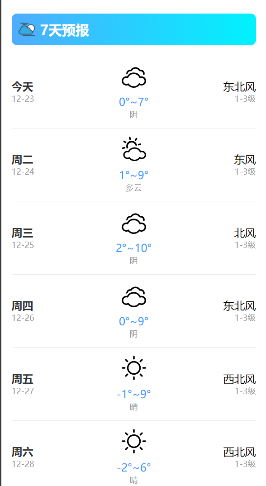
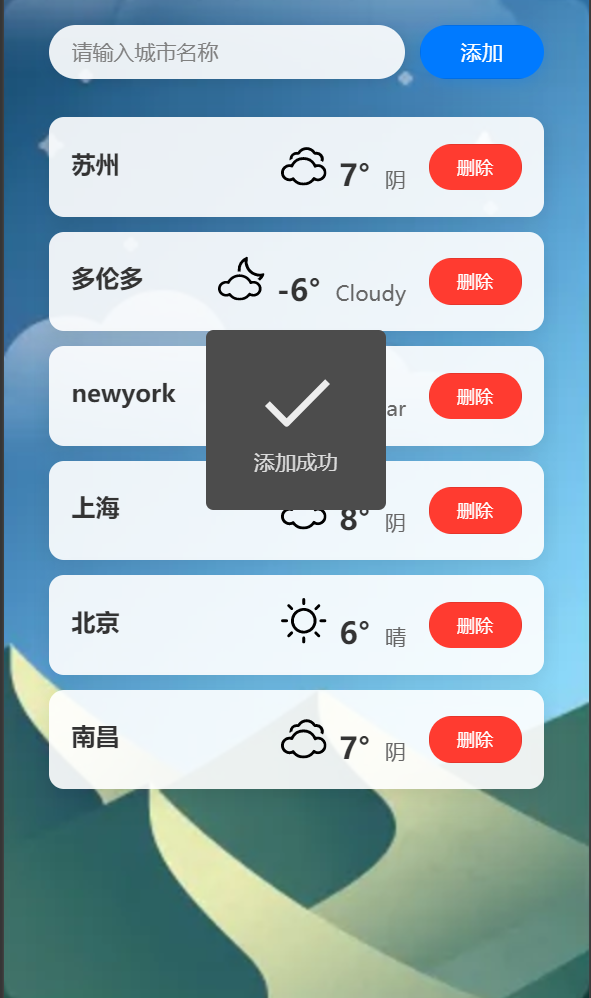
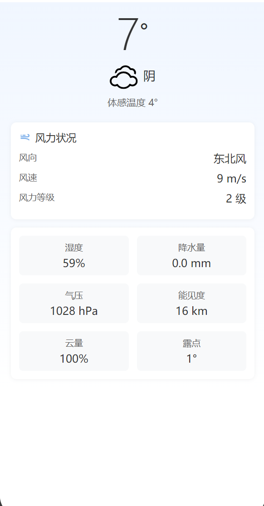

# 和风天气微信小程序

## 项目简介
基于和风天气 API 开发的一款轻量级微信小程序，为用户提供实时天气预报、等信息。
适用于个人天气查询

## 目录
- [项目简介](#项目简介)
- [功能特点](#功能特点)
- [技术栈](#技术栈)
- [代码仓库](#代码仓库)

## 功能特点

- **实时天气**：显示当前所在地的实时24小时天气
  

- **7 日预报**：提供当前所在地未来 7 天的天气信息。

  

- **城市切换**：支持多城市天气查询。

  

  ​			以及当时具体天气情况,例如下面的苏州
  ​			

## 技术栈
- **前端框架**：微信小程序原生框架
- **API 服务**：和风天气 API
- **开发工具**：微信开发者工具

## 代码仓库

具体URL:`https://github.com/YifanNiu1018/WeatherForcast`